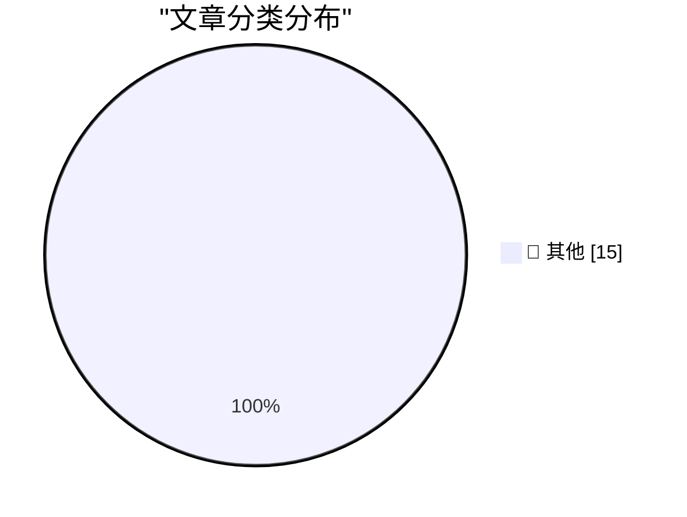

# 📰 AI 博客每日精选 — 2026-10-08

> 来自 Karpathy 推荐的 92 个顶级技术博客，AI 精选 Top 15

## 🏆 今日必读

🥇 **Introducing Claude Haiku 5.5**

[Introducing Claude Haiku 5.5](https://simonwillison.net/2026/Oct/7/claude-haiku-5-5/) — simonwillison.net · 15 分钟前 · 📝 其他

> Introducing Claude Haiku 5.5

🥈 **Anti-Patterns in Software Blogging**

[Anti-Patterns in Software Blogging](https://simonwillison.net/2026/Oct/7/anti-patterns-in-software-blogging/) — simonwillison.net · 6 小时前 · 📝 其他

> Anti-Patterns in Software Blogging

🥉 **Quoting Jake Boggan**

[Quoting Jake Boggan](https://simonwillison.net/2026/Oct/7/jake-boggan/) — simonwillison.net · 16 小时前 · 📝 其他

> Quoting Jake Boggan

---

## 📊 数据概览

| 扫描源 | 抓取文章 | 时间范围 | 精选 |
|:---:|:---:|:---:|:---:|
| 82/92 | 2316 篇 → 15 篇 | 24h | **15 篇** |

### 分类分布

---

## 📝 其他

### 1. Introducing Claude Haiku 5.5

[Introducing Claude Haiku 5.5](https://simonwillison.net/2026/Oct/7/claude-haiku-5-5/) — **simonwillison.net** · 15 分钟前 · ⭐ 15/30

> Introducing Claude Haiku 5.5

---

### 2. Anti-Patterns in Software Blogging

[Anti-Patterns in Software Blogging](https://simonwillison.net/2026/Oct/7/anti-patterns-in-software-blogging/) — **simonwillison.net** · 6 小时前 · ⭐ 15/30

> Anti-Patterns in Software Blogging

---

### 3. Quoting Jake Boggan

[Quoting Jake Boggan](https://simonwillison.net/2026/Oct/7/jake-boggan/) — **simonwillison.net** · 16 小时前 · ⭐ 15/30

> Quoting Jake Boggan

---

### 4. OpenAI “rogue” agent activities found on Wikimedia projects

[OpenAI “rogue” agent activities found on Wikimedia projects](https://simonwillison.net/2026/Oct/7/openai-rogue-agents-wikimedia/) — **simonwillison.net** · 20 小时前 · ⭐ 15/30

> OpenAI “rogue” agent activities found on Wikimedia projects

---

### 5. Quoting Victoria Kim

[Quoting Victoria Kim](https://simonwillison.net/2026/Oct/6/victoria-kim/) — **simonwillison.net** · 21 小时前 · ⭐ 15/30

> Quoting Victoria Kim

---

### 6. llm-openai-decisions 0.1a0

[llm-openai-decisions 0.1a0](https://simonwillison.net/2026/Oct/6/llm-openai-decisions/) — **simonwillison.net** · 22 小时前 · ⭐ 15/30

> llm-openai-decisions 0.1a0

---

### 7. llm-mistral 0.16

[llm-mistral 0.16](https://simonwillison.net/2026/Oct/6/llm-mistral/) — **simonwillison.net** · 23 小时前 · ⭐ 15/30

> llm-mistral 0.16

---

### 8. How to read code

[How to read code](https://seangoedecke.com/how-to-read-code/) — **seangoedecke.com** · 21 小时前 · ⭐ 15/30

> How to read code

---

### 9. ShinyHunters Extorted Boeing Spin-off Prior to Arrests

[ShinyHunters Extorted Boeing Spin-off Prior to Arrests](https://krebsonsecurity.com/2026/10/shinyhunters-extorted-boeing-spin-off-prior-to-arrests/) — **krebsonsecurity.com** · 7 小时前 · ⭐ 15/30

> ShinyHunters Extorted Boeing Spin-off Prior to Arrests

---

### 10. Pluralistic: Disloyalty (07 Oct 2026)

[Pluralistic: Disloyalty (07 Oct 2026)](https://pluralistic.net/2026/10/07/gouged/) — **pluralistic.net** · 7 小时前 · ⭐ 15/30

> Pluralistic: Disloyalty (07 Oct 2026)

---

### 11. Lissajous and Bowditch

[Lissajous and Bowditch](https://www.johndcook.com/blog/2026/10/06/lissajous-and-bowditch/) — **johndcook.com** · 20 小时前 · ⭐ 15/30

> Lissajous and Bowditch

---

### 12. On Git Refs

[On Git Refs](https://matklad.github.io/2026/10/07/git-ref.html) — **matklad.github.io** · 21 小时前 · ⭐ 15/30

> On Git Refs

---

### 13. Package Management RFCs

[Package Management RFCs](https://nesbitt.io/2026/10/07/package-management-rfcs.html) — **nesbitt.io** · 10 小时前 · ⭐ 15/30

> Package Management RFCs

---

### 14. Max Toy, embattled Commodore president

[Max Toy, embattled Commodore president](https://dfarq.homeip.net/max-toy-embattled-commodore-president/?utm_source=rss&#038;utm_medium=rss&#038;utm_campaign=max-toy-embattled-commodore-president) — **dfarq.homeip.net** · 10 小时前 · ⭐ 15/30

> Max Toy, embattled Commodore president

---

### 15. Anti-Patterns in Software Blogging

[Anti-Patterns in Software Blogging](https://refactoringenglish.com/blog/anti-patterns-software-blogging/) — **refactoringenglish.com** · 21 小时前 · ⭐ 15/30

> Anti-Patterns in Software Blogging

---

*生成于 2026-10-08 05:11 (Asia/Shanghai) | 扫描 82 源 → 获取 2316 篇 → 精选 15 篇*
*基于 [Hacker News Popularity Contest 2025](https://refactoringenglish.com/tools/hn-popularity/) RSS 源列表，由 [Andrej Karpathy](https://x.com/karpathy) 推荐*
*由「懂点儿AI」制作，欢迎关注同名微信公众号获取更多 AI 实用技巧 💡*
