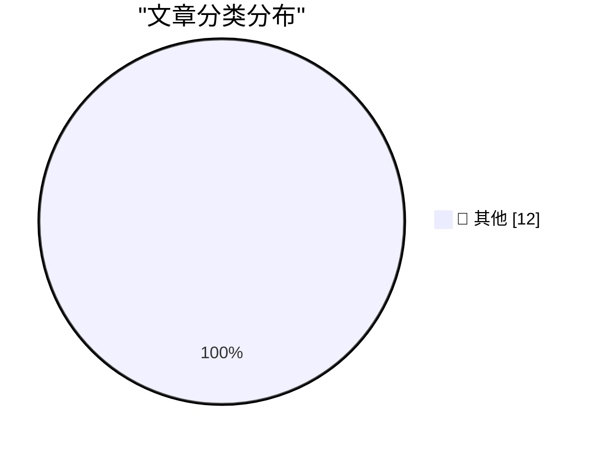

# 📰 AI 博客每日精选 — 2026-10-11

> 来自 Karpathy 推荐的 92 个顶级技术博客，AI 精选 Top 12

## 🏆 今日必读

🥇 **Quoting The New York Times**

[Quoting The New York Times](https://simonwillison.net/2026/Oct/10/the-new-york-times/) — simonwillison.net · 17 小时前 · 📝 其他

> Quoting The New York Times

🥈 **Deno is joining Cloudflare**

[Deno is joining Cloudflare](https://simonwillison.net/2026/Oct/9/deno-is-joining-cloudflare/) — simonwillison.net · 21 小时前 · 📝 其他

> Deno is joining Cloudflare

🥉 **Radxa's Q8B has 2x the performance and expansion of the Pi 5**

[Radxa's Q8B has 2x the performance and expansion of the Pi 5](https://www.jeffgeerling.com/blog/2026/radxa-q8b-double-pi-5/) — jeffgeerling.com · 23 小时前 · 📝 其他

> Radxa's Q8B has 2x the performance and expansion of the Pi 5

---

## 📊 数据概览

| 扫描源 | 抓取文章 | 时间范围 | 精选 |
|:---:|:---:|:---:|:---:|
| 80/92 | 2282 篇 → 12 篇 | 24h | **12 篇** |

### 分类分布

---

## 📝 其他

### 1. Quoting The New York Times

[Quoting The New York Times](https://simonwillison.net/2026/Oct/10/the-new-york-times/) — **simonwillison.net** · 17 小时前 · ⭐ 15/30

> Quoting The New York Times

---

### 2. Deno is joining Cloudflare

[Deno is joining Cloudflare](https://simonwillison.net/2026/Oct/9/deno-is-joining-cloudflare/) — **simonwillison.net** · 21 小时前 · ⭐ 15/30

> Deno is joining Cloudflare

---

### 3. Radxa's Q8B has 2x the performance and expansion of the Pi 5

[Radxa's Q8B has 2x the performance and expansion of the Pi 5](https://www.jeffgeerling.com/blog/2026/radxa-q8b-double-pi-5/) — **jeffgeerling.com** · 23 小时前 · ⭐ 15/30

> Radxa's Q8B has 2x the performance and expansion of the Pi 5

---

### 4. Software's centaur age may last decades

[Software's centaur age may last decades](https://seangoedecke.com/softwares-centaur-age-may-last-decades/) — **seangoedecke.com** · 19 小时前 · ⭐ 15/30

> Software's centaur age may last decades

---

### 5. FBI Arrests Executive at Ransomware Negotiation Firm

[FBI Arrests Executive at Ransomware Negotiation Firm](https://krebsonsecurity.com/2026/10/fbi-arrests-founder-of-ransomware-negotiation-firm/) — **krebsonsecurity.com** · 19 小时前 · ⭐ 15/30

> FBI Arrests Executive at Ransomware Negotiation Firm

---

### 6. Sunnny

[Sunnny](https://sunnny.com/) — **daringfireball.net** · 3 小时前 · ⭐ 15/30

> Sunnny

---

### 7. ‘Proof-of-Human’

[‘Proof-of-Human’](https://x.com/bzamayo/status/2108498107184934914) — **daringfireball.net** · 3 小时前 · ⭐ 15/30

> ‘Proof-of-Human’

---

### 8. Some quick thoughts on Unit Testing ActivityPub

[Some quick thoughts on Unit Testing ActivityPub](https://shkspr.mobi/blog/2026/10/some-thoughts-on-unit-testing-activitypub/) — **shkspr.mobi** · 8 小时前 · ⭐ 15/30

> Some quick thoughts on Unit Testing ActivityPub

---

### 9. Inside a 1980s filter chip that uses switched capacitors

[Inside a 1980s filter chip that uses switched capacitors](http://www.righto.com/feeds/5504631233106574875/comments/default) — **righto.com** · 3 小时前 · ⭐ 15/30

> Inside a 1980s filter chip that uses switched capacitors

---

### 10. This Week in Package Management: 10 October 2026

[This Week in Package Management: 10 October 2026](https://nesbitt.io/2026/10/10/this-week-in-package-management.html) — **nesbitt.io** · 9 小时前 · ⭐ 15/30

> This Week in Package Management: 10 October 2026

---

### 11. Reading List 10/10/26

[Reading List 10/10/26](https://www.construction-physics.com/p/reading-list-101026) — **construction-physics.com** · 5 小时前 · ⭐ 15/30

> Reading List 10/10/26

---

### 12. The Infogrames-Atari merger of 2008

[The Infogrames-Atari merger of 2008](https://dfarq.homeip.net/the-infogrames-atari-merger-of-2008/?utm_source=rss&#038;utm_medium=rss&#038;utm_campaign=the-infogrames-atari-merger-of-2008) — **dfarq.homeip.net** · 8 小时前 · ⭐ 15/30

> The Infogrames-Atari merger of 2008

---

*生成于 2026-10-11 03:59 (Asia/Shanghai) | 扫描 80 源 → 获取 2282 篇 → 精选 12 篇*
*基于 [Hacker News Popularity Contest 2025](https://refactoringenglish.com/tools/hn-popularity/) RSS 源列表，由 [Andrej Karpathy](https://x.com/karpathy) 推荐*
*由「懂点儿AI」制作，欢迎关注同名微信公众号获取更多 AI 实用技巧 💡*
